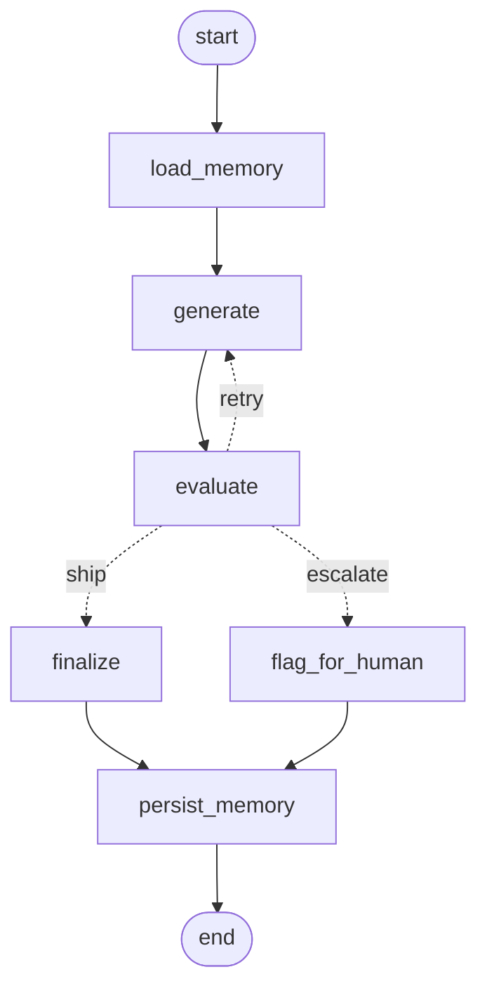

# Self-Evaluating Lesson Generator

An agentic system that writes a beginner lesson, judges it against binary quality
gates, and regenerates until it clears the bar — or escalates to a human when it
cannot.

Built for the NxtWave GenAI Engineer (Content Systems) take-home. Topic:
**Introduction to RAG**, written for a 12th-grade graduate from India with
limited English vocabulary and no technical background.

The point is not one good lesson. It is the loop that decides, with no human
present, whether content is good enough to ship.

---

## The loop



| Node | Does |
|---|---|
| `load_memory` | Reads failure patterns from previous runs and injects them into the generator prompt |
| `generate` | Writes the draft. Same code path for the first attempt and every retry |
| `evaluate` | Judges against 7 binary gates, grounded on a reference document, forced to quote evidence |
| **router** | **The ship / don't-ship decision. Deterministic Python, no LLM** |
| `finalize` | Writes the passing lesson and the rejection log |
| `flag_for_human` | Escalates when the retry budget is spent. Failing content never ships |
| `persist_memory` | Folds this run's failures into cross-run memory |

### This is a workflow, not multi-agent orchestration

There are two LLM *roles* here, but no agents: no tool use, no autonomous
planning, no delegation. The models judge content; they do not choose the
control flow.

That is deliberate. Content QA has to be auditable. If an LLM decided the
routing, the same lesson could get a different verdict on two runs and there
would be no way to tell a curriculum lead why something shipped. **The
intelligence is in the judgment; the control flow stays boring on purpose.**

---

## The rubric: binary gates

The brief is explicit — *"hard pass/fail checkpoints you design — no partial
credit, each check clearly passes or fails."* So there is no blended score and
no threshold to average past. **A lesson ships only if all seven gates pass.**

| Gate | Checks | Brief's dimension |
|---|---|---|
| **G1** | Every technical term defined at first use | *clear, no unexplained jargon* |
| **G2** | All five core concepts present and explained | *covers the key points* |
| **G3** | Answers what it is / why it matters / how it works | *covers the key points* |
| **G4** | At least one concrete worked example traced end to end | *teaches by example* |
| **G5** | Zero claims contradicting the grounding document | *accurate & grounded* |
| **G6** | Readable by a limited-English, non-English-medium reader | *beginner-friendly language* |
| **G7** | Concepts build in order, no unresolved forward references | *coherent teaching flow* |

Four advisory scores (1–5) are also recorded — beginner-friendliness, teaching
flow, example quality, concision. **They never affect the pass decision**, and nothing
consumes them automatically — they are diagnostic telemetry. Their value has
been diagnostic in practice: low advisory scores sitting beside passing gates is
exactly what exposed the evaluator approving a draft it had itself scored 1/5.
The cross-run memory runs on binary gate failures alone. A beautifully written
lesson that skips embeddings is still rejected.

The rubric lives in [`configs/rubric.yaml`](configs/rubric.yaml) as data. Tuning
the quality bar does not require touching the graph.

---

## Why you can trust the evaluator

The standard objection to LLM-as-judge is that the judge just agrees with the
generator. Three independent defences:

**1. It is grounded.** Factual accuracy is checked against
[`grounding/rag_reference.md`](src/lesson_agent/grounding/rag_reference.md), a
short factual reference including a list of common RAG misconceptions. Without a
source of truth, "is this accurate?" is one model's opinion of another model's
output — the exact failure this role exists to prevent. *We use retrieval to
grade a lesson about retrieval.*

**2. It must cite evidence.** Every failed gate must quote the offending span
verbatim. This is enforced by a Pydantic validator that **raises** on an uncited
failure — not by asking nicely in a prompt. A judge that must point at the
problem cannot rubber-stamp.

**3. It is a different vendor from the generator.** Google writes, OpenAI grades.
A model grades its own prose more softly than a stranger's.

**4. Cited quotes are verified against the lesson.** When the judge failed a gate
citing text that did not appear in the lesson, the phantom finding was discarded
rather than driving a pointless retry. This fired during a real run.

**5. Deterministic prechecks sit underneath the judge — because the judge failed.**

This one was not planned. It was forced by a real defect.

During development the LLM evaluator **passed a deliberately sabotaged draft** on
G1 and G6 — dense academic prose, 46-word sentences, "non-parametric memory",
"latent semantic space". On that same draft it scored `example_quality=1` and
`beginner_friendliness=2` out of 5.

So the judge could see the content was bad, and still would not commit to a
binary fail. That is a false negative in a quality gate, which is worse than
having no gate: it ships bad content *while reporting that it checked*.

The fix is not a better prompt. Some of what these gates measure is not a matter
of judgement at all — sentence length is arithmetic, and whether the string
"latent semantic space" appears in a beginner lesson is a lookup.
[`nodes/prechecks.py`](src/lesson_agent/nodes/prechecks.py) computes those
deterministically, for free, before the LLM is called. Measured on the sabotaged
draft the judge passed, they fail G1 and G6 immediately; measured on the shipped
lesson, they raise nothing.

A precheck can only **fail** a gate, never pass one. It is a floor under the
judge, not a replacement for it.

---

## Setup

Requires Python 3.11+ and an [OpenRouter](https://openrouter.ai) key.

```bash
git clone <this-repo> && cd rag-lesson-evaluator
uv venv --python 3.12 && uv pip install -e ".[dev]"
cp .env.example .env     # then paste your OpenRouter key into .env
```

Without `uv`:

```bash
python -m venv .venv && source .venv/bin/activate && pip install -e ".[dev]"
```

`.env`:

```bash
OPENROUTER_API_KEY=sk-or-v1-...
GENERATOR_MODEL=google/gemini-2.5-flash
EVALUATOR_MODEL=openai/gpt-5-mini
MAX_RETRIES=2
```

One key reaches every model, so generator and evaluator can be different vendors
without a second account.

## Run

```bash
.venv/bin/python -m lesson_agent.main                      # normal run
.venv/bin/python scripts/run_deliberate_failure_demo.py    # sabotaged first draft
.venv/bin/python -m pytest tests/ -q                       # 69 tests, offline, no API cost
```

**Cost: ~$0.003 per full run.** A complete three-generation run is a third of a
cent.

### Watching it run

The console trace streams live — each gate resolves on screen as the judge
returns, with the quoted evidence for anything that fails.

To walk the graph one node at a time, inspecting state at every transition:

```bash
.venv/bin/python -m lesson_agent.main --step
```

It pauses after each node and prints the attempt number, status, how many drafts
are in history, the current verdict, and how many memory patterns went into the
prompt. Press `s` at any pause to read the current draft, `q` to stop.

This is the same graph — `--step` uses LangGraph's `stream()` instead of
`invoke()` to surface each transition rather than only the end state. A test
pins that both paths visit the same nodes in the same order, so what you watch
interactively is what runs normally.

### The deliberate-failure demo

A system that passes on the first attempt every time proves nothing — you cannot
tell a working quality gate from one that says yes to everything. The demo swaps
the generator's system prompt for a jargon-heavy academic register on **attempt 1
only**, then restores the real prompt so the retry is a genuine repair. Nothing
in `src/` is modified.

---

## Evidence from real runs

Both directories under `outputs/` are committed output from actual runs.

### A passing run — [`outputs/sample_run/`](outputs/sample_run/)

```
attempt 1  →  REJECT — all 7 gates
attempt 2  →  REJECT — G5 (accuracy overclaim)
attempt 3  →  PASS   — 7/7 gates
```

Both failure shapes appear, which is the point.

**Coverage gates failed on absence**, reported as `missing_requirement`:

> G2: "No explanation of the vector store and the retrieval step; no clear
> description of augmentation..."
>
> G4: "No concrete worked example tracing a real user question through the full
> RAG pipeline appears anywhere in the lesson."

There is no text to quote, because the problem is that the text does not exist.
An earlier schema demanded a verbatim quote for *every* failure, which made
absence literally unreportable — and the evaluator prompt resolved that
contradiction by passing the gate. A lesson with no worked example would have
shipped.

**Content gates failed on a quoted span.** Attempt 2's is worth reading:

> "This answer uses only the information from Chunk 1."

That contradicts the grounding document: the prompt *instructs* the model to use
the retrieved text, but the instruction is a guardrail, not a guarantee. It reads
fluently and confidently, and is wrong only against a source of truth. An earlier
build shipped this exact claim — the judge missed it — which is why the overclaim
family was added to the grounding document's misconception list.

### A run that refused to ship — [`outputs/escalation_run/`](outputs/escalation_run/)

```
attempt 1  →  REJECT — G1, G2, G3, G4, G6, G7
attempt 2  →  REJECT — G5
attempt 3  →  REJECT — G1, G7   (regressed: fixed G5, broke two that had passed)
router     →  ESCALATE — nothing shipped
```

Committed deliberately. A quality gate you have only ever seen say "yes" is not
evidence of a quality gate. Note attempt 3: fixing the targeted failure disturbed
two gates that had already passed. More retries do not converge, they oscillate —
which is the real argument for a small retry budget.

- [`outputs/final_lesson.md`](outputs/final_lesson.md) — the passing lesson
- [`outputs/rejection_log.json`](outputs/rejection_log.json) — what failed, why, and what changed on retry
- [`outputs/run_summary.json`](outputs/run_summary.json) — models, attempts, gates failed per attempt

---

## Memory across runs

[`memory/failure_patterns.json`](memory/failure_patterns.json) accumulates which
gates fail and the text that caused them. Once a gate has failed twice, the next
run's generator prompt opens with:

> *LEARNED FROM PAST RUNS — do not repeat these mistakes:*
> *G1 has failed 2 times in past runs. A previous draft was rejected for: "..."*

Warnings are ranked by what is hurting the system **now**, not by lifetime
total. An earlier version ranked purely by cumulative count, and it learned the
wrong lesson: G5 ended two consecutive runs in escalation while the generator was
being warned about G1, G2, G3 and G4 — gates with bigger piles accumulated
earlier. The gate actually stopping content from shipping was never mentioned to
the writer. Recent failures now count 5x, and a gate that was still failing when
a run gave up counts 10x.

JSON rather than SQLite on purpose: it is ~40 lines, it diffs in a pull request,
it commits as evidence, and you can show it on screen before and after a run.
A binary store buys nothing here and costs a schema and a connection lifecycle.

---

## Trade-offs

**Why 2 retries, not 5?** Cost and evidence. Across runs, a draft that fails the
same gate twice is usually failing on something the generator cannot fix by
rewording. Past that point, retries burn tokens to produce a near-identical
draft. Escalation is more useful than a fourth attempt.

**Why binary gates instead of a score?** The brief requires it — but it is also
right. A 1–10 score lets strong prose average away a missing concept. Binary
gates mean a beautifully written lesson that never explains embeddings is
rejected, which is the correct outcome.

**Why is the router not an LLM?** A quality gate that returns a different answer
on the same input is not a gate. See above.

**Why no UI?** The brief grades architecture and reasoning, not polish. The
console trace shows state transitions, gate-by-gate verdicts, and quoted evidence
better than a web page would, and it cost zero of the time budget.

**What breaks at 10,000 lessons?** Three things. (1) Cost — at ~$0.003/lesson the
bill is fine, but the evaluator re-reads the full grounding document on every
call, so prompt caching would be the first optimisation. (2) The single
`failure_patterns.json` becomes a write-contention point and would need to move
to a real store, partitioned by topic. (3) Gates G1/G6 are cheap enough to run as
deterministic checks first — sentence length, an undefined-term scan against a
glossary — reserving the LLM judge for the gates that actually need judgment.
That would cut evaluator calls substantially.

**The evaluator's false-negative rate is the real open question.** The
prechecks close the measurable part of it. Everything they cannot measure — does
the example actually teach, does the flow actually build — still rests on one
model's reading, and I have one data point saying that reading is not always
reliable. That is the honest state of it.

**What I'd add with another week.** A held-out eval set of known-good and
known-bad lessons to measure the *evaluator* itself — precision and recall on
catching planted errors. Right now I can show the judge catching a deliberate
error; I cannot yet put a number on how often it misses one. That is the gap
between "it works" and "I trust it", and it is the first thing I would close.

---

## Layout

```
configs/rubric.yaml              the quality bar, as data
configs/prompts.yaml             all prompts, outside the code
src/lesson_agent/
  graph.py                       nodes, edges, and the routing decision
  state.py                       what flows between nodes
  nodes/generate.py              first draft and retries — one code path
  nodes/evaluate.py              grounded judging + citation verification
  nodes/finalize.py              outputs, escalation, memory persistence
  models/evaluation.py           schema that rejects an uncited failure
  memory/store.py                cross-run failure patterns
  grounding/rag_reference.md     source of truth for factual accuracy
tests/                           69 tests, no API key required
scripts/run_deliberate_failure_demo.py
```

## A note on `langchain-openrouter`

`ChatOpenRouter` takes `timeout` in **milliseconds**, unlike every other
LangChain chat model, where it is seconds. Passing `timeout=180` means 180ms —
every request times out and the underlying SDK then retries with exponential
backoff for up to an hour, silently, with no error and no output. Verified
against `langchain-openrouter` 0.2.8 / `openrouter` 0.11.46. See
[`utils/llm.py`](src/lesson_agent/utils/llm.py).
